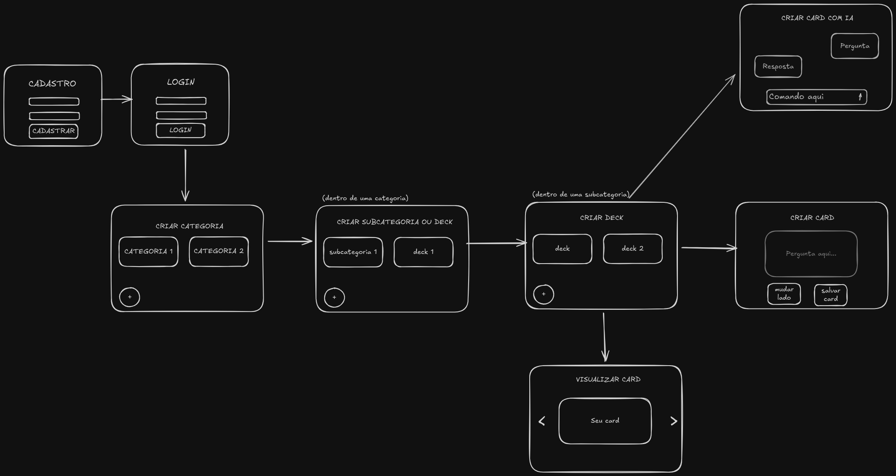

# Flashcard AI

## Visão geral

O **Flashcard AI** consiste em um sistema de criação de flashcards inteligentes de uso manual ou com Inteligência Artifical para ajudar a vida dos estudantes. Escolha uma plataforma de estudos que você confie, insira o link no promp da IA, espere alguns segundos e você terá cards gerados automáticamente por para facilitar seus estudos.

## Wireframe do sistema



## Estrutura das pastas

### Backend

```
flascard-ai
|
├── backend/
|   ├── core/
|   |   ├── asgi.py
|   |   └── settings.py
|   |   └── urls.py
|   |   └── wsgi.py
|   |   
|   ├── users/
|   |     └── models.py
|   | 
|   ├── register/
|   |       ├── views.py
|   |         ├── urls.py
|   |         ├── models.py
|   |         ├── admin.py
|   |         ├── apps.py
|   |         └── tests.py
|   |
|   ├── login/
|   |       ├── views.py
|   |         ├── urls.py
|   |         ├── models.py
|   |         ├── admin.py
|   |         ├── apps.py
|   |         └── tests.py
|   |
|   ├── cards/
|   |   ├── views/
|   |           ├── category.py
|   |           ├── subcategory.py
|   |           ├── deck.py
|   |           └── card.py
|   |        
|   |    ├── serializers/
|   |           ├── category.py
|   |           ├── subcategory.py
|   |           ├── deck.py
|   |           └── card.py
|   |         
|   |    ├── urls/
|   |           ├── category.py
|   |           ├── subcategory.py
|   |           ├── deck.py
|   |           └── card.py
|   |
|   |     ├── models/
|   |           ├── category.py
|   |           ├── subcategory.py
|   |           ├── deck.py
|   |           └── card.py
|   | 
|   ├── requirements.txt
|   └── manage.py
|        
|   docker-compose.yml
|   .gitignore
└── README.md
    
```

## Endpoints

### Categorias

`GET /categories/`

`POST /categories/`

`GET /categories/{id}/`

### Subcategorias

`GET /categories/{id}/subcategories/`

`POST /categories/{id}/subcategories/`

`GET /subcategories/{id}`

### Decks

`GET /decks/{id}/`

`POST /decks/`

### Cards

`GET /decks/{id}/cards/`

`POST /decks/{id}/cards/`
